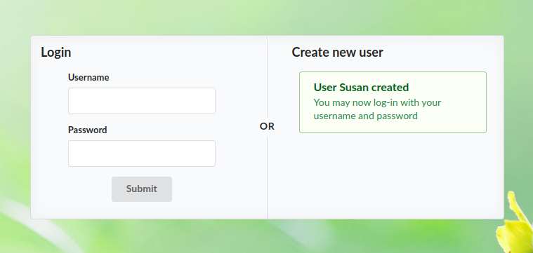
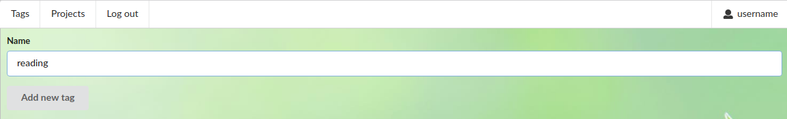
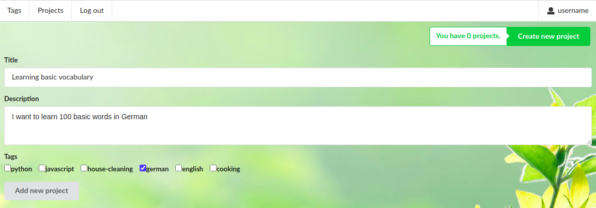
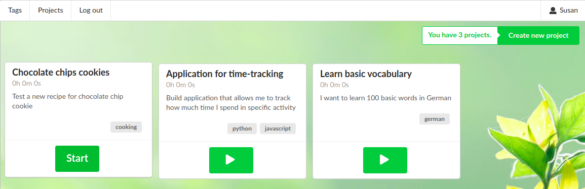
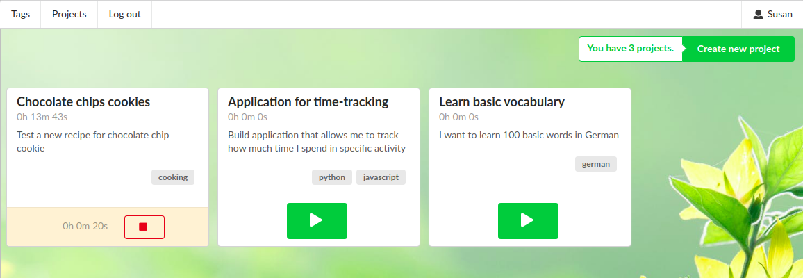

# time-tracker
#### App that helps you to track time you spend on the specific activities

## Architecture
This app is built as a Docker application so it can be easily run and deployed on different environments.
It is managed with docker-compose and it consists of 3 containers (services):
- **backend** - developed in Django, a Python framework for web applications
- **db** - Postgres database used by Django ORM
- **frontend** - developed in React, a Javascript library for user interfaces (+ Semantic UI as CSS framework)

## Start development server
> sudo docker-compose up

## UI preview
#### Creating a new user

#### Adding a new activity tag

#### Adding a new project (activity)

#### Start tracking time for specific activity

#### Time is tracked until you click stop
